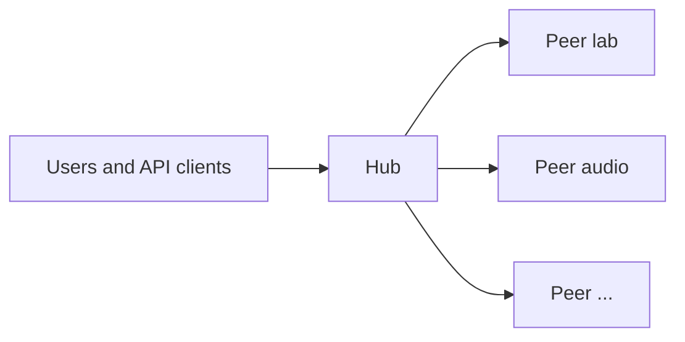
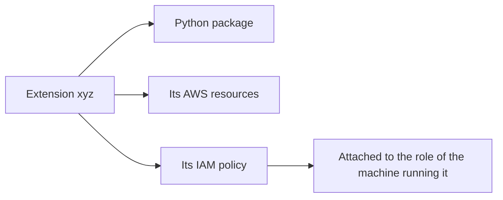
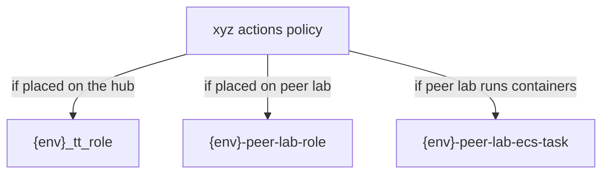
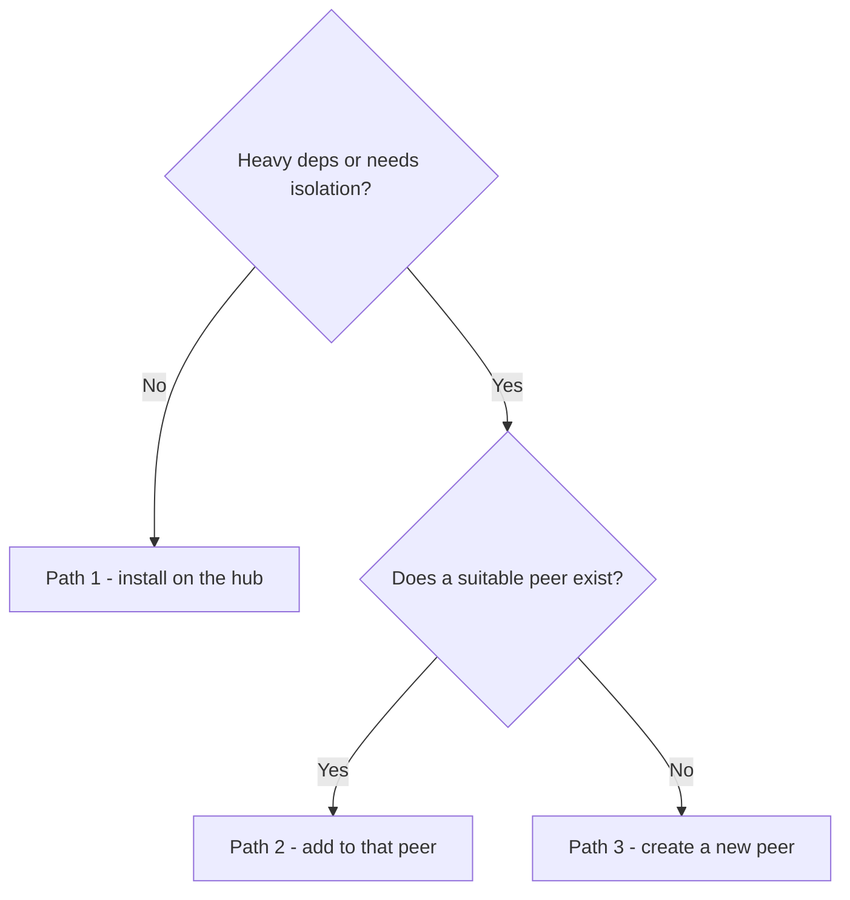
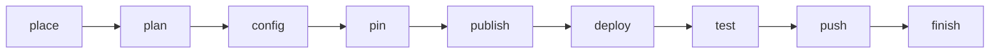

# The `extensions` CLI

A guided installer for adding a new extension to a Renglo tenant.

If you have never installed an extension before, read Part 1 first — the commands only make sense once you know what a hub, a peer, and a handle are.

- [Part 1 — What problem this solves](#part-1--what-problem-this-solves)
- [Part 2 — Get the CLI](#part-2--get-the-cli)
- [Part 3 — Decide where the extension goes](#part-3--decide-where-the-extension-goes)
- [Part 4 — Install it](#part-4--install-it)
- [Part 5 — After the install](#part-5--after-the-install)
- [Part 6 — Reference](#part-6--reference)

---

## Part 1 — What problem this solves

### A Renglo system is a hub plus a set of peers

A Renglo deployment is not a single application. It is one **hub** and any number of **peers**.




The **hub** is the API backend that every client talks to. It authenticates requests, holds the core data model, and decides who should do the work.

A **peer** is a stand-alone worker node with its own compute, its own IAM role, and its own dependency set. The hub forwards a request to a peer and gets a result back. Peers do not talk to clients directly.

### Extensions are how features get added

A feature is not added by editing the hub. It is packaged as an **extension** and installed onto a machine.

An extension has a **handle** — the short name that appears in request routing, e.g. `data`, `schd`, or `xyz` in the examples below. The handle is how the hub knows which extension a request is for.

Every extension has to run *somewhere*, and there are only two kinds of somewhere:


| Where it runs  | What that means                                                                                                                                                         |
| -------------- | ----------------------------------------------------------------------------------------------------------------------------------------------------------------------- |
| **On the hub** | The extension's code is bundled into the API backend itself. Best for lightweight extensions with no heavy dependencies.                                                |
| **On a peer**  | The extension's code is bundled into a peer's deployment package. This is the normal choice: the extension gets isolation, its own dependency set, and its own scaling. |


A peer can host several extensions — they share that peer's compute and deployment package. One extension, however, has exactly **one** owner. It is on the hub or on one peer, never both.

### Extensions often need their own AWS infrastructure

Extensions are rarely just code. An extension may need a dedicated S3 bucket, a search index, or other resources. Those get created at install time.

Creating a bucket does not grant access to it, so every extension also ships an **IAM policy**. That policy is attached to whichever machine actually runs the extension:




This is why placement matters. If `xyz` is installed on the hub, the hub's role gets the policy. If `xyz` is installed on peer `lab`, the `lab` peer's role gets it and the hub does not. Access follows placement.

### Which policies exist, and who gets them

The extension's policy is not the only one in play. Each machine's role accumulates several managed policies, and the install adds exactly one more. It is worth knowing which is which, because it tells you why a permission error is happening and where to fix it.

#### The policy the extension brings

Every extension ships one IAM policy document at `extensions/<handle>/installer/infra/<policy_file>`, named in its `cdk_extension.json`. At deploy time the owning stack turns that document into a **managed policy** and attaches it to the role(s) of the machine that runs the extension.

This is the policy that must grant access to the extension's own resources. Declaring a bucket under `s3_buckets` creates the bucket; it does **not** grant anything. If the policy document does not list the S3 actions, the extension will deploy cleanly and then fail at runtime with access denied.

Who receives it depends entirely on placement:




| Placement | Policy name                                                                      | Attached to                                                                                                           |
| --------- | -------------------------------------------------------------------------------- | --------------------------------------------------------------------------------------------------------------------- |
| Hub       | The `policy_name` from `cdk_extension.json`, e.g. `{env}-arbitiumtriage-actions` | `{env}_tt_role` — the hub API role                                                                                    |
| Peer      | Always renamed to `{env}-peer-<peer>-<handle>-actions`                           | `{env}-peer-<peer>-role` (the peer's Lambda role) and, unless the peer is `lambda_only`, `{env}-peer-<peer>-ecs-task` |


Two important details:

- On a peer, the policy is **renamed** regardless of what `cdk_extension.json` says. Peers and Stack B share an account, so the peer id and handle are forced into the name to keep two stacks from fighting over one managed policy.
- On a peer, the `attach_policy_to_roles` list in the manifest is effectively **ignored**. That list is resolved only on the hub, where `{env}_tt_role` is available. A peer stack attaches the policy to its own roles, which is what you want — an extension on `lab` should get `lab`'s permissions, not the hub's.

#### The policies that were already there

The extension policy is attached alongside baseline policies that the platform created earlier. Nothing in the install modifies these:


| Role                              | Where it lives  | What it already carries                                                                                                |
| --------------------------------- | --------------- | ---------------------------------------------------------------------------------------------------------------------- |
| `{env}_tt_role`                   | Hub API         | `{env}_tt_policy` (tenant baseline) and the Stack A AI storage policy                                                  |
| `{env}-peer-<peer>-role`          | Peer Lambda     | AWS Lambda basic execution, the peer's handlers policy, and `{env}_tt_policy`                                          |
| `{env}-peer-<peer>-ecs-task`      | Peer containers | The peer's handlers policy, `{env}_tt_policy`, and an inline task policy                                               |
| `{env}-peer-<peer>-ecs-execution` | Peer containers | Only the AWS-managed ECS execution policy — it pulls images and writes logs, and **never** receives extension policies |


So a peer Lambda running `xyz` ends up holding the tenant baseline, the peer's own handlers permissions, and `xyz`'s actions policy. If you add a second extension to the same peer, that peer's roles gain a second actions policy — which is also why a peer hosting many extensions accumulates permissions, and a reason to consider a dedicated peer for anything sensitive.

### Where placement is recorded

Placement lives in one file, the **catalog**: `ops/<tenant>-bom/deploy_targets.yml`. It lists every extension package, which extensions are on the hub, and which peers exist with which extensions on each.

The catalog is the single source of truth. The CDK stacks read it to decide what to build, so there is no second place to configure.

Alongside the catalog, the BOM repo holds **pins**: version files that say exactly which package versions a deployment uses. A new extension needs a new pin so that CI knows to include it.

### Incubating vs product

Released extensions move through **release trains** managed by `git convoy`. A brand-new extension is not ready for that — it has no catalog entry, no infrastructure, no published package.

So an extension being installed is marked `role = "incubating"` in its `gitconvoy.toml`, which makes git-convoy trains skip it. Once installation is complete and verified, it is flipped to `role = "product"` and joins the normal release cycle.

### What the CLI does

The `extensions` CLI walks you through that one-time journey: edit the catalog, create a pin, publish the first package, deploy the infrastructure, verify it, push, and graduate the extension to product.

It keeps an **incubation sheet** at `<workspace>/.extensions/state.json` recording what you are installing, where, with which AWS profile, and how far you have gotten. Each command reads that sheet, so you never repeat yourself, and `extensions status` always tells you the next command to run.

The CLI covers installation only. Once the extension is product, releases are git-convoy's job.

---

## Part 2 — Get the CLI

Once per machine, from `ops/bom-helper`:

```bash
bash setup-venv.sh
source bom-venv/bin/activate
```

This creates `bom-helper/bom-venv` and installs `extensions` onto your `PATH`. The venv is deliberately **not** called `venv` — that name belongs to the application's own environment, and with several terminals open it should be obvious which one is active. With the venv active you can run it from **any** folder in the monorepo — it walks up from your current directory to find the workspace or an active incubation sheet.

```bash
extensions help
extensions tree
```

If you would rather not activate a venv, `pipx install -e /path/to/ops/bom-helper` gives you a global `extensions`. The wrapper `ops/bom-helper/scripts/extensions` also works without activation.

### Before you start an install

You need three things in place:

1. **The extension's installer files** — `extensions/<handle>/installer/infra/cdk_extension.json` plus its policy JSON. The policy must list the actual S3 actions; declaring a bucket in `cdk_extension.json` does not grant access to it.
2. **A buildable package** — `extensions/<handle>/package/pyproject.toml`, so `install publish` can build a wheel.
3. **An existing tenant** — Stack A and Stack B already deployed. You do not deploy Stack A for a new extension; it already permits hub → peer traffic.

You also need the name of an AWS CLI profile with access to the tenant account. You pass it once, on the first command.

---

## Part 3 — Decide where the extension goes

Three placements are possible. Pick one before you start; the choice is the first thing you tell the CLI.




**Path 1 — on the hub.** The extension is small and shares the API's dependencies. Its code ships inside the backend image and its IAM policy goes on the hub role. Nothing peer-related is touched. Use this sparingly: everything on the hub shares one deployment and one blast radius.

**Path 2 — on an existing peer.** The most common choice. The extension joins a peer that already exists, e.g. `lab`. It shares that peer's compute and deployment package, and its policy is attached to that peer's roles. The hub gains no new permissions — it just learns to route the handle there.

**Path 3 — on a new peer.** The extension needs its own isolated node: conflicting dependencies, a different scaling profile, or a security boundary. This creates a new peer stack that initially hosts only this extension. Existing peers are untouched.

For paths 2 and 3, note the difference between a handle and a peer id. A **handle** (`xyz`) is an extension. A **peer id** (`lab`, `audio`) is a machine that can host several handles.

New peers have a compute mode: `fargate` (default) or `ec2` for containerised work, `lambda_only` if the extension has no heavy handlers. Compute can be changed later — it is just an update to that peer's stack.

---

## Part 4 — Install it

The same nine commands run for all three paths. Only the first one differs, because only the first one says where the extension goes.




Run them in order. If you lose your place, run `extensions status`.

### Step 1 — `place`: declare the target

This is the only step where the three paths differ. Choose the line that matches your decision from Part 3:

```bash
# Path 1 — on the hub
extensions install place xyz --hub --profile my-aws-profile

# Path 2 — on the existing peer "lab"
extensions install place xyz --peer lab --profile my-aws-profile

# Path 3 — on a new peer "audio"
extensions install place xyz --new-peer audio --compute fargate --profile my-aws-profile
```

`place` writes almost nothing. It creates the incubation sheet, marks the extension's `gitconvoy.toml` as `incubating`, and refuses to continue if the handle is already in the catalog or already `product`.

The `--profile` you pass here is **stored on the sheet** and reused by every later step that talks to AWS, so you never have to export `AWS_PROFILE`. The region comes from `customer-config.json` unless you override it with `--region`.

### Step 2 — `plan`: preview

```bash
extensions install plan
```

Read-only. It prints the catalog edits it will make, the pin it will create, and the exact deploy commands it will run. Worth reading once before you let it change anything.

### Step 3 — `config`: record the placement

```bash
extensions install config
```

Edits `deploy_targets.yml` and nothing else. It registers the package under `packages:`, then attaches it to its owner: `hub.python` for path 1, `peers.lab.extensions` and `peers.lab.python` for path 2, or a brand-new `peers.audio` block for path 3.

### Step 4 — `pin`: create a version

```bash
extensions install pin --python-version 0.0.1
```

Creates a **new** BOM version file and bumps the pointer to it — the current pin file is never edited in place. Hub installs get a new `bom/vNEXT.json`; peer installs get `peers_bom/<peer>/vNEXT.json`. If you omit `--python-version`, it reads the version from the extension's `pyproject.toml`.

### Step 5 — `publish`: build and upload the package

```bash
extensions install publish
```

Builds the wheel and uploads it to CodeArtifact. This is the one-off first publish; later versions are published by the release train, not by hand. Use `--skip-upload` to build without uploading.

### Step 6 — `deploy`: create the infrastructure

```bash
extensions install deploy
```

This is the step that creates the extension's buckets, indexes, and IAM policy in AWS, and attaches that policy to the roles of the machine that will run it (see [Which policies exist, and who gets them](#which-policies-exist-and-who-gets-them)). The CLI picks the right stack from the sheet:


| Path          | Stack deployed                    |
| ------------- | --------------------------------- |
| Hub           | `{env}-stack-b`                   |
| Existing peer | `{env}-peer-lab`                  |
| New peer      | `{env}-peer-audio` (created here) |


It then runs `bootstrap/install.py write-state`, which refreshes the tenant's SSM configuration — including the route that maps the handle to the machine now serving it. The CLI does not reimplement that; it calls the bootstrap tool.

Run `extensions install deploy --dry-run` first if you want to see the commands without executing them.

### Step 7 — `test`: verify

```bash
extensions install test
```

Confirms the installer files are present and — importantly — that the catalog gives the extension exactly one owner. A handle claimed by both the hub and a peer, or by two peers, fails here.

### Step 8 — `push`: commit the BOM

```bash
extensions install push
```

Commits and pushes the changed BOM files to `main`, which triggers CI. This is the only time you push a BOM by hand for this extension; from now on that is git-convoy's job. Use `--yes` to skip the confirmation, `--no-push` to commit locally only.

### Step 9 — `finish`: graduate to product

```bash
extensions install finish
```

Flips `gitconvoy.toml` to `role = "product"`, refreshes git-convoy membership, and deletes the incubation sheet. It refuses to run unless you have pushed and `test` passed.

The extension is now a normal product repo.

---

## Part 5 — After the install

Confirm the extension joined the product cycle:

```bash
git convoy --json status   # xyz should be product
```

From here the CLI is no longer involved in releases. New versions of the extension ride release trains: cut a train or hotfix, `git convoy adopt --bom ops/<tenant>-bom`, and push. Do not use `install pin`, `install publish`, or `install push` again for this handle — the CLI actively refuses once the role is `product`.

### Inspecting an existing system

These read-only commands work at any time, whether or not something is being installed:

```bash
extensions tree             # every extension and the machine that owns it
extensions show xyz         # one extension: owner, package, role, installer files
extensions status           # the current incubation, if any, and the next command
```

---

## Part 6 — Reference

### Commands


| Command                             | What it does                                |
| ----------------------------------- | ------------------------------------------- |
| `extensions help [topic]`           | List commands                               |
| `extensions status`                 | Current incubation sheet and next step      |
| `extensions show HANDLE`            | One extension's placement and state         |
| `extensions tree`                   | Map of all extensions to their owners       |
| `extensions install place HANDLE …` | Start an install (requires `--profile`)     |
| `extensions install plan`           | Preview, changes nothing                    |
| `extensions install config`         | Edit `deploy_targets.yml`                   |
| `extensions install pin`            | New BOM version file and pointer bump       |
| `extensions install publish`        | Build and upload the first wheel            |
| `extensions install deploy`         | Deploy the owning stack, then `write-state` |
| `extensions install test`           | Installer files and unique owner            |
| `extensions install push`           | Commit and push the BOM                     |
| `extensions install finish`         | `role = product`, clear the sheet           |


Useful flags: `--json` on any command; `--workspace PATH` to override auto-detection; `--dry-run` on `deploy`; `--skip-upload` on `publish`; `--yes` / `--no-push` on `push`; `--compute` and `--task-size` on `place --new-peer`.

### Phases

The sheet advances through `placed → configured → pinned → published → deployed → tested → pushed`, then `finish` clears it. `plan` is read-only and does not advance anything.

### Files the install touches


| File                                                               | When                                        |
| ------------------------------------------------------------------ | ------------------------------------------- |
| `extensions/<handle>/gitconvoy.toml`                               | `place` (incubating) and `finish` (product) |
| `<workspace>/.extensions/state.json`                               | Every step; deleted by `finish`             |
| `ops/<tenant>-bom/deploy_targets.yml`                              | `config`                                    |
| `ops/<tenant>-bom/bom/vNEXT.json` or `peers_bom/<peer>/vNEXT.json` | `pin`                                       |


Never touched: `ops/launcher/cdk/customer-config.json`, and Stack A.

### Which tool owns what


| Tool                               | Responsibility                                                                      |
| ---------------------------------- | ----------------------------------------------------------------------------------- |
| `extensions install`               | One-time installation: placement, first pin and publish, infrastructure, graduation |
| `git convoy`                       | Everything after that: trains, hotfixes, adopt, ongoing pins                        |
| `bootstrap/install.py write-state` | The tenant's SSM configuration; called by `install deploy`                          |


### Doing it by hand

[NEW_EXTENSION.md](NEW_EXTENSION.md) walks the same three paths as manual file edits and raw CDK commands. Use it to understand what the CLI is doing, or when you need to deviate from the standard flow.