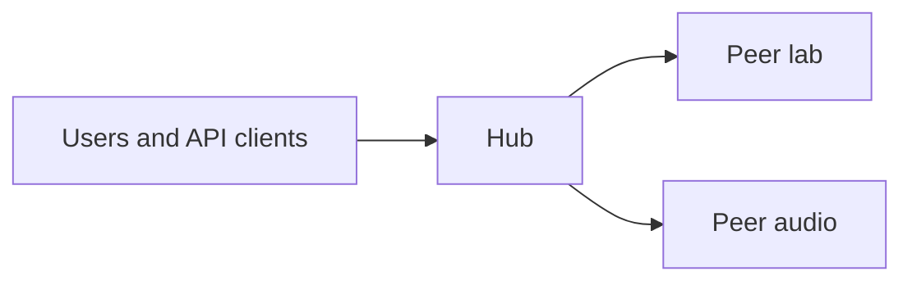
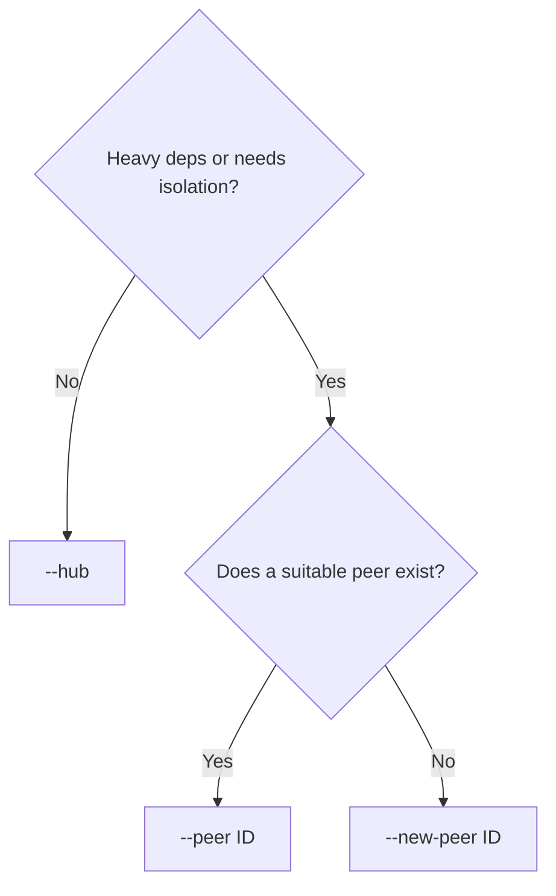
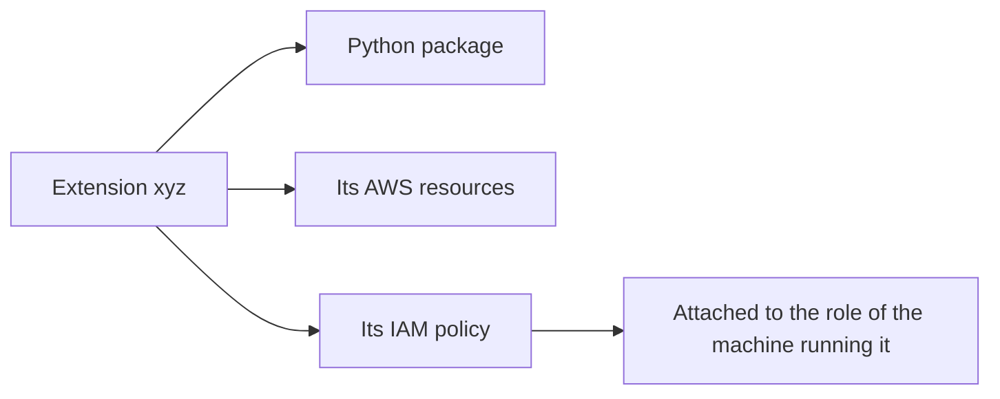
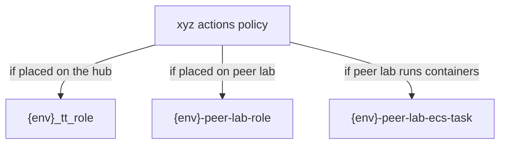

# Extension install (`renglo extension`)

Operator commands live in the **[Renglo CLI README](../renglo-cli/README.md)**. This page is the placement model those commands assume: hub vs peer, handles, and which IAM policy lands where.

```bash
cd ops/renglo-cli
bash setup_venv.sh
source renglo-venv/bin/activate
renglo help extension
renglo extension tree
```

Install sequence (every path):

```text
place → plan → config → pin → publish → deploy → test → push → finish
```

`renglo extension status` prints the next command. `deploy` never touches stack A.

If you need to edit files and run CDK by hand, use [NEW_EXTENSION.md](NEW_EXTENSION.md).

---

## Hub, peers, and handles

A Renglo deployment is one **hub** plus any number of **peers**.



The **hub** is the API every client talks to. A **peer** is a worker with its own compute and permissions. The hub forwards a job; peers do not talk to clients.

A feature is packaged as an **extension** with a **handle** (the short name used in routing, e.g. `data`, `xyz`). Every extension runs in exactly one place:


| Where it runs  | What that means |
| -------------- | --------------- |
| **On the hub** | Code is bundled into the API. Lightweight extensions only. One blast radius. |
| **On a peer**  | Code is bundled into that peer. Isolation, its own dependency set, its own scaling. Normal choice. |

A peer can host several extensions. One extension has exactly **one** owner — hub or one peer, never both.

### Pick a placement



`--compute` on a new peer: `fargate` (default) or `ec2` for containers, `lambda_only` if there are no heavy handlers. Compute can be changed later by updating that peer.

A **handle** (`xyz`) is an extension. A **peer id** (`lab`, `audio`) is a machine that can host several handles.

---

## IAM follows placement

Extensions are rarely just code. An extension may need a bucket, a search index, or other resources. Those are created at deploy time.

Creating a bucket does not grant access. Every extension ships an **IAM policy**. That policy is attached to whichever machine actually runs the extension:



### The policy the extension brings

Every extension ships one policy document under `extensions/<handle>/installer/infra/`, named in its `cdk_extension.json`. At deploy time the owning stack turns that document into a managed policy and attaches it to the role(s) of the machine that runs the extension.

Who receives it depends entirely on placement:



| Placement | Policy name | Attached to |
| --------- | ----------- | ----------- |
| Hub | The `policy_name` from `cdk_extension.json`, e.g. `{env}-arbitiumtriage-actions` | `{env}_tt_role` — the hub API role |
| Peer | Always renamed to `{env}-peer-<peer>-<handle>-actions` | `{env}-peer-<peer>-role` (Lambda) and, unless `lambda_only`, `{env}-peer-<peer>-ecs-task` |

On a peer, the policy is **renamed** regardless of what `cdk_extension.json` says (peers and stack B share an account). The hub-side `attach_policy_to_roles` list is ignored on a peer — the peer stack attaches to its own roles.

### Policies that were already there

The extension policy is attached alongside baseline policies. Nothing in the install modifies these:

| Role | Where it lives | What it already carries |
| ---- | -------------- | ----------------------- |
| `{env}_tt_role` | Hub API | Tenant baseline and stack A AI storage |
| `{env}-peer-<peer>-role` | Peer Lambda | Lambda basic execution, the peer's handlers policy, and the tenant baseline |
| `{env}-peer-<peer>-ecs-task` | Peer containers | The peer's handlers policy, tenant baseline, and an inline task policy |
| `{env}-peer-<peer>-ecs-execution` | Peer containers | AWS-managed ECS execution only — **never** receives extension policies |

A peer Lambda running `xyz` holds the tenant baseline, the peer's handlers permissions, and `xyz`'s actions policy. A second extension on the same peer adds a second actions policy — a reason to give anything sensitive its own peer.

---

## Before `place`

1. Installer files — `extensions/<handle>/installer/infra/cdk_extension.json` plus its policy JSON. The policy must list the actual S3 (or other) actions.
2. A buildable package — `extensions/<handle>/package/pyproject.toml`.
3. An existing tenant — stacks A and B already deployed. You do not deploy stack A for a new extension.

Pass the AWS profile once, on `place`. Later steps reuse it.

After `finish`, the handle is product. Do not use `install pin`, `install publish`, or `install push` again for it.

Read-only at any time:

```bash
renglo extension tree
renglo extension show HANDLE
renglo extension status
```
