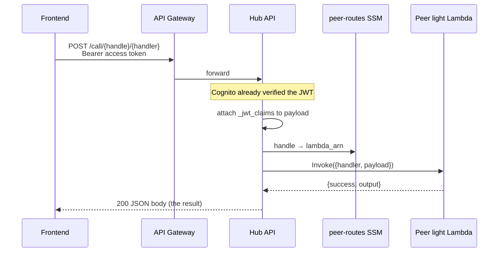

# Golden paths: sync+light and async+heavy

Production remote only (not laptop Docker / in-process). The hub is Stack A/B `renglo-api` (`{env}-backend-{stage}`). A peer is `{env}-peer-{peerId}` (zip Lambda) plus, when `compute` is `fargate`/`ec2`, `{env}-peer-{peerId}-ecs`.

**Actors**

| Name | What it is |
| --- | --- |
| Frontend | Amplify console |
| Cognito | Access token for the API |
| API Gateway | HTTPS to the hub |
| Hub | `renglo-api` Lambda |
| SSM | `/{env}/bootstrap/peer-routes` (handle → peer) |
| Peer light | `{env}-peer-{peerId}` Lambda (zip upload) |
| Peer heavy | `{env}-peer-{peerId}-ecs` cluster / task |
| S3 | Peer results bucket `{env}-peer-{peerId}-ecs-{account}` |

IDs that show up in **logs only** (AWS mints them; the product does not poll them): API Gateway request id, hub Lambda request id, peer Lambda request id. Cognito `jti` / `sub` travel as `_jwt_claims` on the payload; they are not the job id.

URL `portfolio` / `org` / handle come from the console session. They are tenant entity ids, not per-call jobs.

---

## 1. Sync + light

Example: `POST /staging/_schd/<portfolio>/<org>/call/arbitiumtriage/blast_radius`

The handler is **not** in `heavy_handlers`. Frontend waits on one HTTP response. **No platform `request_id`. No ECS `task_id`.**



| Stage | Who | Id minted? | Id used |
| --- | --- | --- | --- |
| Click / fetch | Frontend | No | Bearer token (Cognito issued earlier) |
| HTTPS | API Gateway | AWS request id (logs) | — |
| Auth + route | Hub | No | Handle from URL; peer Lambda name from SSM |
| Invoke | Hub → peer zip | No | Event `{ handler, payload }` only |
| Run handler | Peer zip | AWS Lambda request id (logs) | Payload `portfolio` / `org` / `_jwt_claims` |
| Response | Hub → Frontend | No | Same HTTP body; nothing to poll |

If this path returns 200 with handler output, light smoke on that handle is done.

---

## 2. Async + heavy

Example: `POST /staging/_schd/<portfolio>/<org>/call/arbitiumtriage/aws_aid_orchestrator/start`

The handler **is** in `heavy_handlers`. Frontend gets a job mailbox, then polls. Two product ids:

- **`request_id`** — UUID minted by the **hub**. S3 keys and poll query string.
- **`task_id`** — minted by **ECS** (`run_task` ARN tail). Logs / stop-task. Frontend does not poll it.

```mermaid
sequenceDiagram
  participant FE as Frontend
  participant Hub as Hub API
  participant SSM as peer-routes SSM
  participant S3 as Peer S3 bucket
  participant ECS as Peer ECS
  participant Task as ECS task (handler)

  FE->>Hub: POST /call/{handle}/{handler}/start<br/>Bearer access token
  Hub->>Hub: request_id = uuid4()
  Hub->>SSM: handle → cluster, task family, bucket
  Hub->>S3: PUT payloads/{request_id}.json
  Hub->>ECS: run_task + env REQUEST_ID, S3 keys
  ECS-->>Hub: taskArn → task_id
  Hub-->>FE: 202 { request_id, task_id }

  loop poll
    FE->>Hub: GET /async/status?extension=&request_id=
    Hub->>S3: GET status/{request_id}.json
    S3-->>FE: missing → pending; else { step }
    FE->>Hub: GET /async/result?extension=&request_id=
    Hub->>S3: GET results/{request_id}.json
    S3-->>FE: missing → pending; else completed
  end

  ECS->>Task: start container
  Task->>S3: GET payloads/{request_id}.json
  Task->>S3: PUT status/{request_id}.json (optional, as it goes)
  Task->>S3: PUT results/{request_id}.json (once, when done)
```

| Stage | Who | Id minted? | Id used |
| --- | --- | --- | --- |
| POST `/start` | Frontend | No | Bearer token |
| Accept batch | Hub | **`request_id`** = `uuid4()` | Writes `payloads/{request_id}.json`; sets container env `REQUEST_ID`, `PAYLOAD_S3_*`, `RESULT_S3_*`, `STATUS_S3_*` |
| Place task | ECS | **`task_id`** (ARN tail) | Hub returns it in 202; not used as S3 key |
| 202 body | Hub → Frontend | — | Frontend stores **`request_id`** for polls |
| GET `/async/status` | Frontend → Hub → S3 | No | Query `request_id` → `status/{request_id}.json` |
| GET `/async/result` | Frontend → Hub → S3 | No | Query `request_id` → `results/{request_id}.json` |
| Run handler | Peer ECS task | No | Env `REQUEST_ID` (copy of hub uuid); inner handler calls are in-process, no new job |
| Progress | Handler (optional) | No | Overwrites `status/{request_id}.json` |
| Finish | ECS entrypoint | No | Writes **one** `results/{request_id}.json` |

Hub never fans out N zip invokes under this id. One `/start` = one mailbox = one task. Work that looks like “many calls” happens **inside** that task.

Heavy smoke: 202 with `request_id`, then `/async/result` `status: completed`, and the task runs on `{env}-peer-{peerId}-ecs` (not `{env}-handlers-ecs`). `/batch/result` and `/batch/status` remain aliases during soak.

---

## What is not a golden path

| Pair | Why not |
| --- | --- |
| Async + light | Production `/start` rejects names that are not in `heavy_handlers`. |
| Sync + heavy | Code can wait on ECS inside the hub HTTP request (`call_ecs_handler`, 15 min poll). Do not use for smoke; API Gateway will usually die first. |
